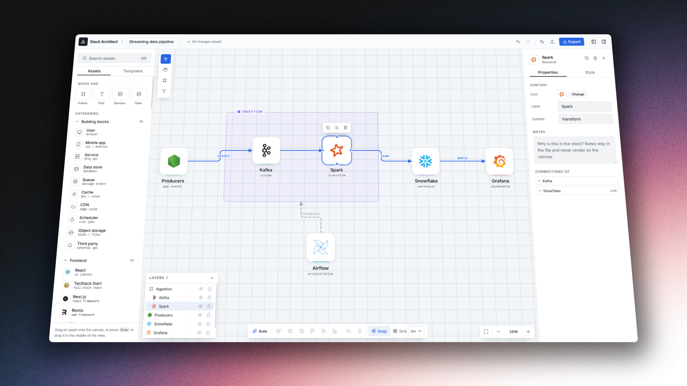

<h1 style="text-align:center">Stack Architect</h1>



<i style="text-align:center; display:block;">A browser-based editor for tech stack diagrams.</i>

Drag services onto a canvas, group them into layers, draw labeled connections between them, and export the result as PNG or SVG. Everything runs client side with no account needed.

## Features

- **Real brand icons.** Currently shipping several hundred services (Vercel, Postgres, Redis, Cloudflare, ...) with icons from [svgl](https://svgl.app) via `@ridemountainpig/svgl-react`.

- **Three node types.** Tech cards for services, resizable group frames for layers, and free-standing text notes.

- **Edges that mostly take care of themselves.** Connections pick the geometrically best of the four sides of a card and re-evaluate as nodes move, then place their labels clear of crossings. You can pin endpoints manually when you disagree with the choice.

- **Auto layout.** Dagre arranges a messy canvas into a layered diagram using the known node dimensions.

- **A real editing experience.** Undo/redo (60 snapshots), copy/cut/paste, duplicate, snap to grid, alignment tools, multi-select, keyboard shortcuts, etc.

- **Autosave and export.** The document persists to localStorage on every change. Export to PNG, SVG, or JSON, and import JSON back. Stateful sharing links may come in the future.

## Stack

- Vite + React 19 + TypeScript
- [React Flow](https://reactflow.dev) (`@xyflow/react`) for the canvas
- Zustand for state: one store holds nodes, edges, selection, tool mode, history, and persistence (`src/lib/store.ts`)
- Tailwind v4 with shadcn/ui components
- React Compiler enabled through Babel

## Getting started

```bash
npm install
npm run dev
```

Other scripts:

```bash
npm run build          # tsc -b && vite build; this is also the typecheck
npm run lint           # oxlint
```

There is no test runner yet, so verify changes with lint plus build.

## Project layout

```
src/
  components/
    app/      top bar
    flow/     canvas, node renderers, inspector, asset palette, panels
    ui/       shadcn/ui primitives
  lib/
    store.ts            single zustand store, undo/redo, localStorage
    types.ts            node/edge data shapes, document serialization
    catalog.ts          curated tech list + categories
    catalog-generated.ts  generated from svgl (do not edit by hand)
    icons.ts            slug → icon resolution, alias fixes
    layout.ts           dagre auto-layout
    export.ts           PNG / SVG / JSON export and import
    templates.ts        starter document
  hooks/
    use-editor-shortcuts.ts
```

## Working on the icon catalog

The palette list comes from two places. Curated entries in `src/lib/catalog.ts` win; everything else is generated by scanning every component in `@ridemountainpig/svgl-react`, with metadata pulled from the public svgl API. After bumping the svgl package:

```bash
node scripts/generate-svgl-catalog.mjs
```

If an icon resolves under a different name than our slug (say `drizzle` vs `drizzleorm`), add it to the alias maps in `src/lib/icons.ts` rather than renaming slugs across the catalog.

## Conventions worth knowing

- TypeScript runs with `verbatimModuleSyntax` and `erasableSyntaxOnly`: type-only imports need `import type`, and enums, namespaces, and parameter properties don't compile.
- Both `package-lock.json` and `bun.lock` are committed. If you change dependencies with one package manager, regenerate the other lockfile too.
- To reset local dev state, delete the `tech-stack-architect:*` keys in localStorage.
