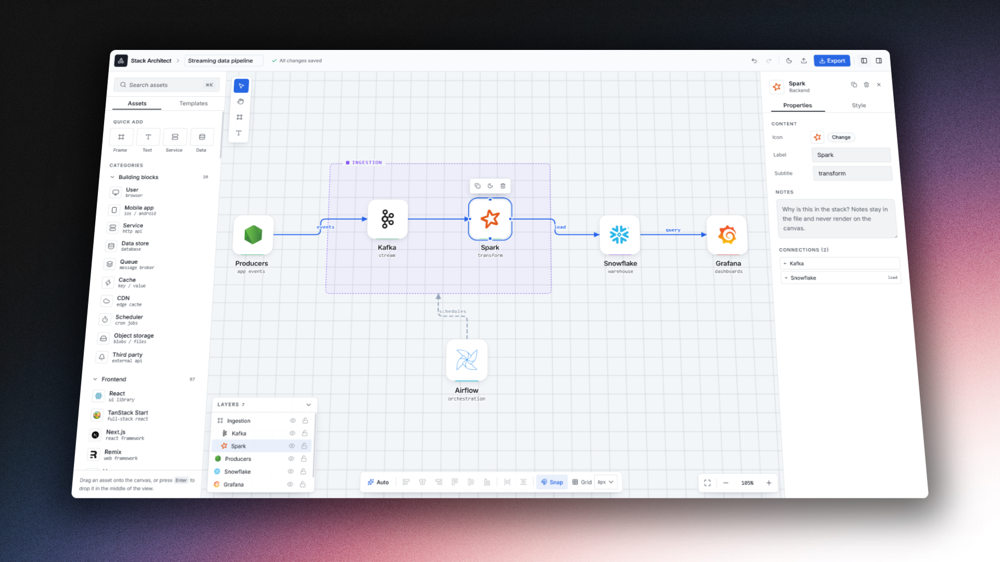

# Stack Architect



Stack Architect is a browser editor for tech stack diagrams. Add services, group them into layers, connect them, and share an editable diagram. You can also export PNG, SVG, or JSON.

The editor works without an account and saves changes locally. Turso provides optional project sharing. A remote MCP endpoint lets coding agents create diagrams from repositories.

## Features

- Several hundred brand icons from [svgl](https://svgl.app), with a curated catalog for common services.
- Tech cards, resizable group frames, and text notes.
- Connections that choose sensible endpoints and keep labels clear of nodes. Endpoints can also be pinned manually.
- Dagre auto-layout for arranging a rough diagram into layers.
- Undo and redo with 60 snapshots, copy and paste, multi-select, keyboard shortcuts, and grid snapping.
- Alt-drag duplication plus Ctrl-held alignment and equal-spacing guides.
- Local autosave, JSON import, and PNG, SVG, or JSON export.
- Short share links with queued server sync for the browser that created the link.
- Repository diagrams through MCP and the included `stack-architect` skill.

## Sharing

Selecting Share creates a project in Turso and copies a link such as `/?project=abc123DEF456`.

The browser that creates the project stores a private edit token in localStorage. It queues local changes and syncs them once per minute. The save indicator shows whether changes are local, pending, syncing, or synced. Its refresh button sends changes immediately.

A recipient only receives the public project ID. Opening the link imports the latest server copy into localStorage, removes the query parameter, and leaves the recipient with an independent local diagram. Recipients never receive the edit token and cannot overwrite the shared source.

The API accepts diagrams up to 1 MB. It allows 10 new projects per client per minute and 30 updates per client and project per minute.

Rate-limit counters live in Turso, so they apply across server instances. The server stores an HMAC fingerprint of each client address rather than the address itself.

## MCP

The MCP server exposes `search_architecture_icons`, `review_architecture_document` and `create_architecture_project` at `/api/mcp`. Your agent analyzes the repository, looks up exact icons from the editor's catalog, reviews the draft for crowded nodes, busy boundaries and pale frame accents, and sends a `GraphDocument` with styled relationships. Stack Architect validates it, arranges the nodes and connection points, saves it in Turso, and returns a project link. Icon search and draft review are read-only and do not consume the creation quota. Review findings guide composition; they do not prove a diagram has no crossings.

The endpoint uses stateless Streamable HTTP and runs in the same Nitro deployment as the editor. Repository analysis stays with the agent; the server receives only the diagram.

The endpoint is public. Connect to `https://stack.axelc.dev/api/mcp`; no API key, token, or account is required.

### Set up with your agent

Give your coding agent this prompt:

> Set up the Stack Architect MCP and skill for me using https://raw.githubusercontent.com/Sleepy-gogo/stack-architect/main/mcp-instructions.md

The [setup instructions](mcp-instructions.md) cover client configuration, skill installation, and a connection check. They use the hosted endpoint by default; provide another URL if you host your own instance.

### Manual setup

For Codex, add this to your user-level `~/.codex/config.toml`:

```toml
[mcp_servers.stack_architect]
url = "https://stack.axelc.dev/api/mcp"
```

Copy [skills/stack-architect](skills/stack-architect) into `~/.agents/skills/stack-architect`, the [documented user-level skills directory](https://learn.chatgpt.com/docs/build-skills), then restart the agent session. If your client already loads the skill from another user directory, update that copy instead of installing a duplicate. The skill is available from any repository:

> Use $stack-architect to analyze this repository and create an editable architecture diagram.

Other MCP clients can use the same URL with Streamable HTTP and authentication set to none. See the [Codex MCP documentation](https://learn.chatgpt.com/docs/extend/mcp) for its configuration options.

### Host your own server

Alongside the Turso credentials described below, configure:

```env
STACK_ARCHITECT_PUBLIC_URL=https://your-stack-architect.vercel.app
```

Use the editor's HTTPS origin for `STACK_ARCHITECT_PUBLIC_URL`, without a path, query, or fragment. For local development, `http://localhost:5173` is also accepted. The endpoint stays disabled until the public URL is configured.

On Vercel, set the public URL and Turso credentials as server environment variables, then deploy. Clients only need the endpoint URL. Keep Turso credentials private.

### Results and limits

The tool returns `projectId`, `url`, and `editing: "local-copy"`. The link opens an editable copy with the same sharing behavior described above. Anyone with the link can read the diagram, so keep secrets and source code out of it.

The [input reference](skills/stack-architect/references/graph-input.md) includes a sample document. The tool's advertised schema defines the accepted fields.

| Limit                 | Value                                  |
| --------------------- | -------------------------------------- |
| Complete request body | 128,000 bytes                          |
| Diagram size          | 80 nodes, 160 edges                    |
| MCP requests          | 60 per minute, shared across clients   |
| Creation attempts     | 100 per UTC day, shared across clients |

The server rejects invalid diagrams before saving. Request limits return HTTP 429 with `Retry-After`; creation limits return a tool error with retry guidance. A timed-out request may still have created a project. Check before retrying to avoid duplicates.

Quotas are stored in Turso and apply across server instances. They limit MCP activity, not all hosting costs; rejected requests still reach the server. Use your hosting provider's firewall to block abusive traffic when needed.

## Tech stack

- Vite, React 19, and TypeScript
- Nitro server routes
- Turso through `@tursodatabase/serverless`
- [React Flow](https://reactflow.dev) for the canvas
- Zustand for editor state, history, and persistence
- Tailwind CSS v4 and shadcn/ui components
- React Compiler through Babel

## Local development

Install dependencies and start the dev server:

```bash
npm install
cp .env.example .env
npm run dev
```

Set the following variables in `.env` to enable sharing:

```env
TURSO_DATABASE_URL=libsql://your-database-your-org.turso.io
TURSO_AUTH_TOKEN=your-database-token
```

Keep both values on the server. Do not expose them through `VITE_` variables.

The share API creates and upgrades its tables on first use. [`server/schema.sql`](server/schema.sql) contains the base schema if you prefer to create it yourself.

## Checks

```bash
npm test
npm run lint
npm run build
```

Tests cover public MCP access, protocol handling, validation, limits, and layout using in-memory persistence. The build also checks TypeScript.

## Deploy

On Vercel, configure the environment variables above and build with `npm run build`; Nitro detects the deployment platform. To build Vercel output locally:

```sh
NITRO_PRESET=vercel npm run build
```

In PowerShell, set `$env:NITRO_PRESET = "vercel"` before running the build.

## Project layout

| Directory                 | Contents                                                 |
| ------------------------- | -------------------------------------------------------- |
| `src/components/`         | Editor, canvas, inspector, and UI components             |
| `src/lib/`                | Diagram types, state, layout, icons, sharing, and export |
| `server/api/`             | Project and MCP routes                                   |
| `server/mcp/`             | MCP handler and document validation                      |
| `server/utils/`           | Turso persistence and rate limits                        |
| `skills/stack-architect/` | Installable repository-analysis skill                    |
| `tests/`                  | MCP tests                                                |

## Updating the icon catalog

Curated entries in `src/lib/catalog.ts` take priority. The generated catalog scans `@ridemountainpig/svgl-react` and reads metadata from the svgl API.

After updating the svgl package, regenerate the catalog:

```bash
node scripts/generate-svgl-catalog.mjs
```

The generator also updates `src/lib/icon-names-generated.ts`, allowing the server to search the same catalog without importing SVG artwork. If an icon uses a different export name than its catalog slug, add the svgl mapping in `src/lib/icon-names.ts`. Simple Icons fallback mappings remain in `src/lib/icons.ts`. Do not rename the slug across the catalog.

## Repository notes

- TypeScript uses `verbatimModuleSyntax` and `erasableSyntaxOnly`. Use `import type` for type-only imports.
- Commit both `package-lock.json` and `bun.lock` when dependencies change.
- To reset local editor state, remove the `tech-stack-architect:*` keys from localStorage.
